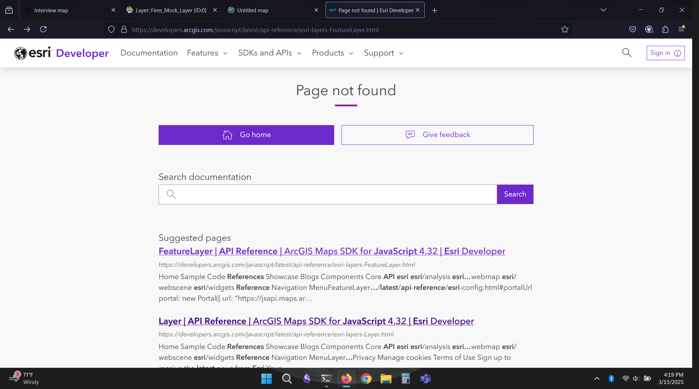
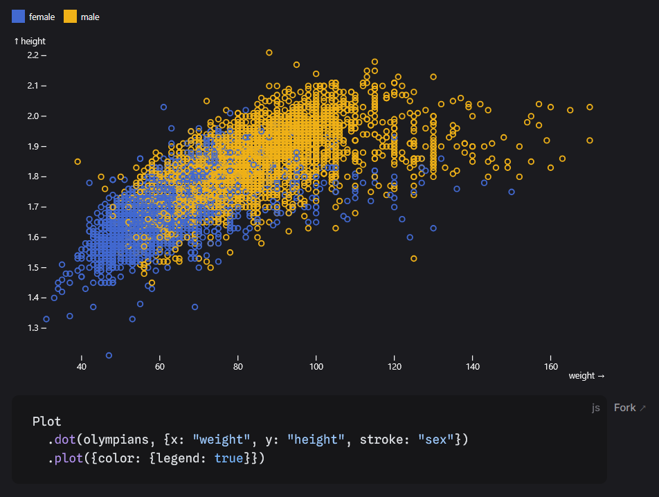
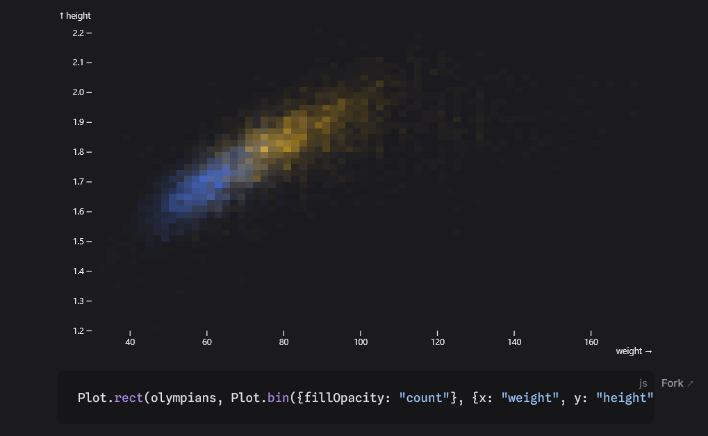
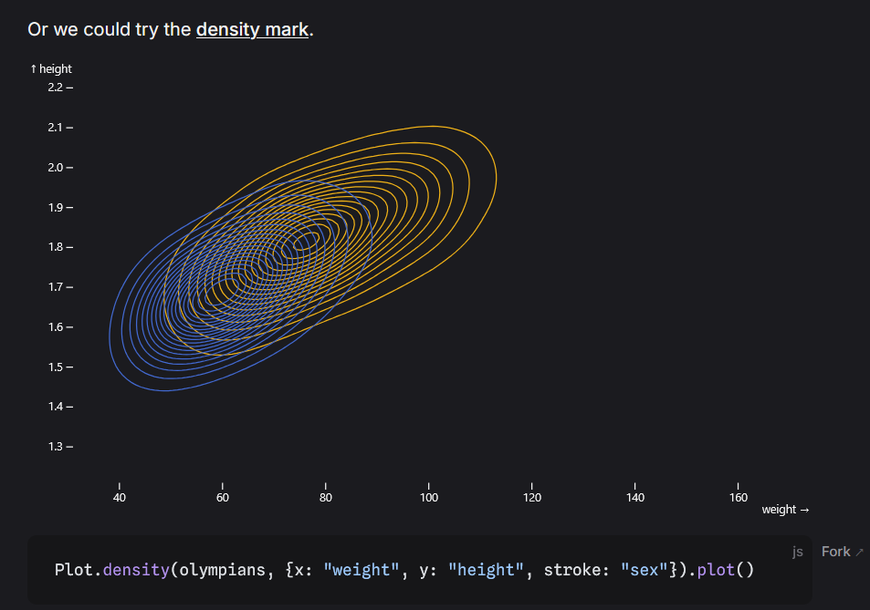

# Technical Challenge Notes - BR
## Eric Kerney - 3/19/2025 
### United States Fires Data Map 
#### Primary Tasks 
- [ ] Fix bug in US Fires Popup for percent_confidence attribute 
- [ ] US Fires Layer Checkbox Toggle - updateLayerVisibility()
- [ ] ScaleBar widget at bottom right part of map 
- [ ] Basemap Gallery widget 
#### Additional Exercise 
- [ ] Spec out plan and scope of Chart Data Visualization 
#### Bonus Features 
- [ ] Refactor updateLayerVisibility() for reusability with other map layers with id param and findLayerById() 
- [ ] Add additional US Wildfires Layer from ESRI Living Atlas 
- [ ] Additional checkbox to toggle wildfires 
- [ ] Additional sliders for wildfires DailyAcres & PercentContained 
- [ ] Create new popup template for wildfires 
- [ ] Adjust layout and styling for ControlPanel.tsx 
- [ ] Add calcite dark mode styling to better highlight fire data
- [ ] Change basemap gallery to basemap toggle, conserving screen real estate 

### Notes 
Fixing the specified bugs did not present significant difficulty.    
Attribute name for percent confidence was misspelled: percentconfidence - and changed to percent_confidence.  
This information was found by viewing the source for the FeatureLayer, and reviewing feature attributes in the Service Definition via ArcREST.     

The ESRI docs for the most recent version of the Maps SDK were broken last weekend(!) Luckily they seemed to be restored by Monday...
<br />

<br />

A simple method to toggle layer visibility is to use the LayerList widget.  This only needs to be imported and added to the map, with no additional react state management.  Initially, the way I implemented updateLayerVisibility(), even passing an id string, was hard coded to the us-fires layer.  With 2 lines of code we can implement a dynamic selector using the mapview.map.findLayerById(id) method. 
```javascript
    // hard coded version 
    if (this.firesLayerView) this.firesLayerView.visible = !this.firesLayerView?.visible;
    
    // updated dynamic selector 
    const selectedLayer = this.#mapview?.map.findLayerById(id);
    if (selectedLayer) selectedLayer.visible = !selectedLayer?.visible;

```
   
It was also fairly straightforward to add both the ScaleBar and BasemapToggle Widgets.  The newer [ESRI reccommend method for importing the map-components](https://developers.arcgis.com/javascript/latest/references/map-components/arcgis-scale-bar/) won't work with the older version of the arcgis library in the project.  I found the BasemapGallery occupied a large amount of screen real estate and instead opted for the BasemapToggle widget with streets-dark as the map toggle.  It is a simple switch between the 2 basemap widgets. 

Some of the bonus features I've added were to bring in another layer from the Living Atlas of US Wildfires.  Adding an additional layer config was also straightforward, and just a matter of mostly duplicating the original config.  This layer has some nice fire symbols built in, and quite a few attributes that could be useful for insights and analysis.  In order to test the control panel and map for what it might look like for multiple layers, it has been added to the control panel with it's own filter sliders for Acres and Percent contained.  Also duplicated the popup template with its relevant attributes, and switched to calcite dark theme styling and updated the panel to match the dark theme.  

updateFeatureFilter() was also updated for filtering of the wildfires layer.   
The attributes were added to the function params, and an if statement validates that the respective layer is loaded and ready to filter.  
```javascript 
updateFeatureFilter = async (
	brightness: number, 
	confidence: number, 
	percentContained: number, 
	dailyAcres: number ) => {
    if (this.firesLayerView) {
      const where = `brightness > ${brightness} AND percent_confidence > ${confidence}`;
      this.firesLayerView.filter = new FeatureFilter({ where: where });
    }
    if (this.wildfiresLayerView) {
      const where = `DailyAcres > ${dailyAcres} AND PercentContained > ${percentContained}`;
      this.wildfiresLayerView.filter = new FeatureFilter({ where: where });
    }
  };

```

### Future Improvements
The basemap switching could be improved, perhaps allowing the user to specify a BasemapGallery or BasemapToggle option.  A custom switcher would be even better, controlling the layout and style, and number of basemap icons per row.  The useEffect() for the filter sliders has quite a few dependencies, as each slider variable is added to the dependency array.  It could be possible to remove this useEffect altogether by linking the filtering function inside of a new onChange function.  This could improve the performance of the app and reduce re-rendering.  Additionally perhaps only the relevant props could be passed to updateFeatureFilter(), in order to reduce more and more parameters being added to the signature.  This would entail sending more detailed information to the method as props.  

The control container div's are starting to repeat in the ControlPanel, and could be refactored into their own separate smaller component.  This would cleanup the render portion of ControlPanel.ts.  Another nice refactor would be to add dynamic min/max for the feature filter values on the input sliders.  These values are currently hard coded.  A dark/light mode toggle would also be a nice add.  
### Additional Exercise 
Adding charts is a useful addition to the spatial data visualization.  They can provide insights that are not apparent by looking at the map.  Their are several solid options for adding javascript plots to the app: ChartJS, D3.js, Chartist, Recharts, and Observable Plot.  Typically we would go with the library that our developers are most familiar with, though in this case I would like to explore [Observable Plot](https://observablehq.com/plot/).  Observable Plot provides more customization than the other options, it's built on top of D3, and utilizes the standard grammar of graphics style.  Plot is free and open source, with plenty of examples to learn from.  Plot has customizable marks that can be styled to match the symbols from the map.    

This feature could be implemented by one developer without a significant time investment.  Exploratory example plots can be created in a few days, and the feature completed in one week.  Additional processing of the fires data would likely be needed to prep for visualization in the plot.  One method to achieve this is to convert the features into GeoJSON, and then create an array of values for analysis.  This is fairly efficient for layers with 100's or even 1000's of features.  If the number of features became greater than 100K, we may want to explore other methods to directly query and clean only the required data, or move the analysis to an API.  

Plot - Scatterplot Example
<br />

<br />
Plot - Binplot Example
<br />

<br />
Plot - Density Markplot Example
<br />

